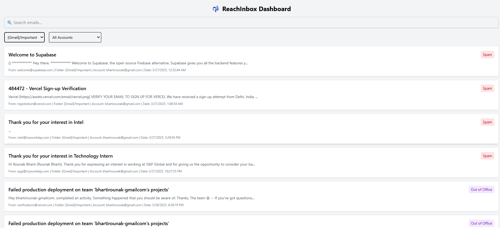
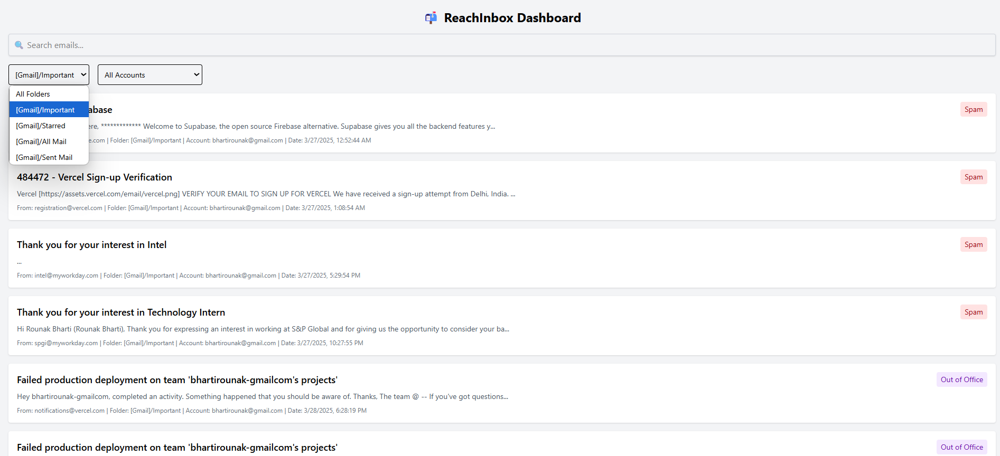
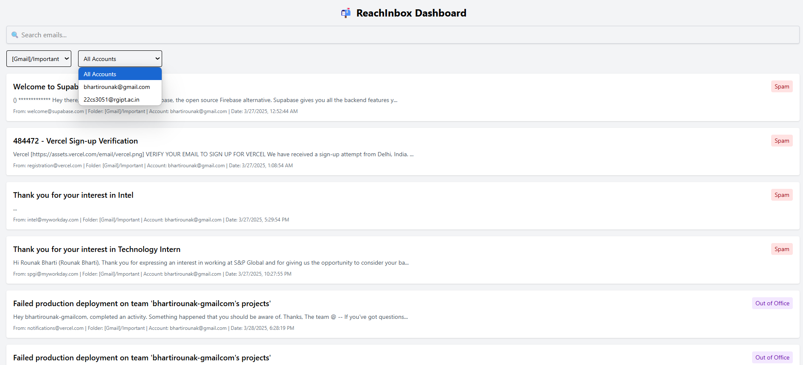
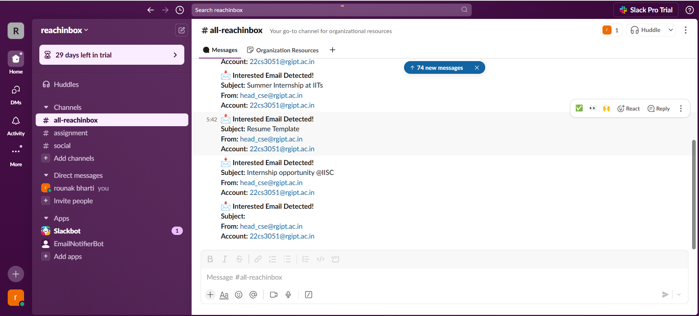
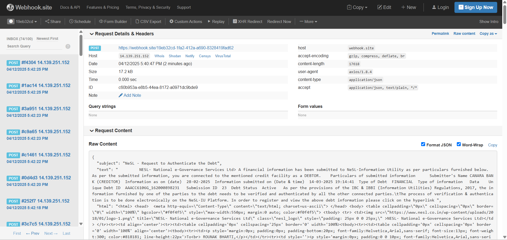
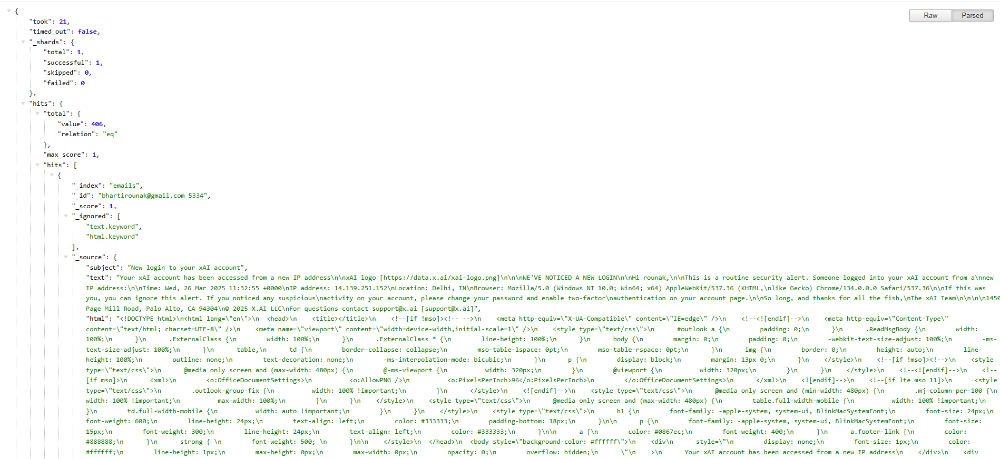
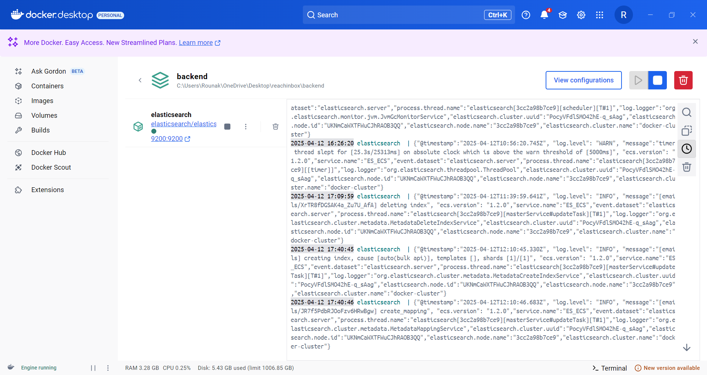
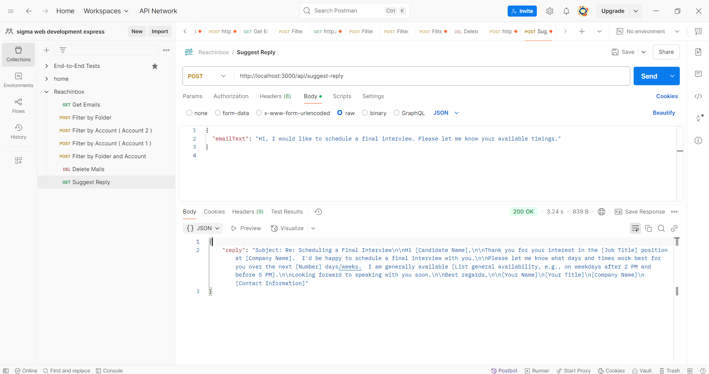

# ReachInbox Assignment - Onebox Email Aggregator

This repository contains my submission for the **Associate Backend Engineer** position at ReachInbox. The project is a feature-rich onebox email aggregator built with TypeScript and Node.js, featuring real-time IMAP synchronization, Elasticsearch-powered search, AI-based email categorization, Slack/webhook integration, a frontend interface, and AI-powered reply suggestions using Retrieval-Augmented Generation (RAG).

## Demo Video

Click below to watch a 5-minute demo showcasing all functionalities:  
[Watch Demo Video](https://drive.google.com/file/d/1xxbtCBjpIwL3sB21lhcmivYGnERbLtGi/view?usp=sharing)

## 📸 Demo Screenshots
| Feature          | Image |
|-----------------|-------|
| Emails fetched on the frontend        |  |
| Filter by folder|  |
| Filter by account     |  |
| Slack notifications for interested Emails      |  |
| Webhook.site Triggered    |  |
| Locally hosted elasticsearch   |  |
| Elasticsearch instance running in Docker      |  |
| R A G suggests a  perfect reply     |  |

## Features Implemented

1. **Real-Time Email Synchronization**
   - Syncs two IMAP email accounts in real-time using IDLE mode (no polling).
   - Fetches emails from all folders (e.g., Inbox, Sent) for the last 30 days.

2. **Searchable Storage using Elasticsearch**
   - Stores emails in a locally hosted Elasticsearch instance via Docker.
   - Indexes emails for full-text search, with filtering by folder and account.

3. **AI-Based Email Categorization**
   - Converts emails to embeddings, stored in Elasticsearch.
   - Categorizes emails as Interested, Meeting Booked, Not Interested, Spam, or Out of Office using similarity search against sample data.

4. **Slack & Webhook Integration**
   - Sends Slack notifications for emails labeled as Interested.
   - Triggers webhooks to [webhook.site](https://webhook.site) for Interested emails.

5. **Frontend Interface**
   - Displays emails with filters for folder/account and Elasticsearch-powered search.
   - Shows AI-assigned categories per email.

6. **AI-Powered Suggested Replies (RAG)**
   - Stores outreach data in a vector database.
   - Uses Retrieval-Augmented Generation with an LLM to suggest replies, e.g., sharing a meeting link for Interested emails.

## Architecture Details

- **Backend**: TypeScript/Node.js for modular and scalable code.
  - **IMAP**: Uses `imap` library with IDLE mode for real-time sync.
  - **Elasticsearch**: Indexes emails for search/filtering, hosted in Docker.
  - **AI Categorization**: Embeds emails, performs similarity search for labeling.
  - **RAG**: Retrieves context from a vector database, generates replies via LLM.
  - **Integrations**: Slack notifications and webhooks for automation.
- **Frontend**: Built with React, fetching data from backend APIs.
- **Storage**: Elasticsearch for emails, vector database for RAG context.
- **Environment**: Docker for Elasticsearch, Node.js for backend, npm for frontend.

## 📁 Project Structure

```
REACHINBOX/
├── backend/
│   ├── node_modules/
│   ├── src/
│   │   ├── config/                 # ElasticSearch and IMAP configurations
│   │   ├── controllers/            # API controllers
│   │   ├── data/                   # Knowledge base files (e.g. JSON)
│   │   ├── embeddings/             # Embedding scripts and configs
│   │   ├── indexer/                # Elastic indexing logic
│   │   ├── pipeline/               # Email classification pipeline
│   │   ├── routes/                 # Express route handlers
│   │   ├── scripts/                # Utility scripts for setup/indexing
│   │   ├── services/               # Core logic for processing, AI, notifications
│   │   ├── test/                   # RAG testing
│   │   ├── utils/                  # Utility functions (LLMs, Slack, similarity)
│   │   └── app.ts                  # Entry point for backend
│   ├── .env                        # Environment variables
│   ├── .gitignore
│   ├── docker-compose.yml
│   ├── package.json
│   ├── package-lock.json
│   ├── seedContexts.ts
│   └── tsconfig.json
│
├── frontend/
│   ├── node_modules/
│   ├── public/                    # Static assets
│   ├── src/
│   │   ├── assets/                # Images and SVGs
│   │   ├── components/            # Reusable UI components
│   │   ├── pages/                 # Page-level components
│   │   ├── services/              # API service handlers
│   │   ├── styles/                # CSS styles
│   │   ├── App.tsx                # Root component
│   │   ├── index.tsx              # Entry point
│   │   ├── main.tsx
│   │   └── vite-env.d.ts
│   ├── .gitignore
│   ├── eslint.config.js
│   ├── index.html
│   ├── package.json
│   ├── package-lock.json
│   ├── README.md
│   ├── tsconfig.app.json
│   ├── tsconfig.json
│   ├── tsconfig.node.json
│   └── vite.config.ts
```


## Installation

1. **Clone the Repository**:
   ```bash
   git clone https://github.com/rounakbharti/reachinbox.git
   cd reachinbox
   cd backend

2. **Install Dependencies**:
    ~~~bash
    npm install
    ~~~

3. **Configure Environment**:
   - Create a `.env` file:
        ~~~env
        IMAP_USER1=your-email1@example.com
        IMAP_PASS1=your-password1
        IMAP_HOST1=imap.example.com
        IMAP_PORT1=993
        IMAP_USER2=your-email2@example.com
        IMAP_PASS2=your-password2
        IMAP_HOST2=imap.example.com
        IMAP_PORT2=993
        
        SLACK_WEBHOOK_URL=https://hooks.slack.com/services/xxx
        WEBHOOK_URL=https://webhook.site/your-id
        GEMINI_API_KEY=your-gemini-api-key
        ~~~

4. **Run Elasticsearch**:
    ~~~bash
    docker run -d -p 9200:9200 -e "discovery.type=single-node" elasticsearch:8.8.0
    ~~~

5. **Start Backend**:
    ~~~bash
    npm run start
    ~~~

6. **Start Frontend**:
    ~~~bash
    cd frontend
    npm install
    npm run start
    ~~~


## 📬 Contact
📧 **Email:** [bhartirounak@gmail.com](mailto:bhartirounak@gmail.com)  
🔗 **GitHub:** [https://github.com/rounakbharti](https://github.com/rounakbharti)  
🌐 **Project Repository:** [Reachinbox](https://github.com/rounakbharti/reachinbox)  

💡 *For any issues or suggestions, feel free to open a GitHub issue!* 🚀
